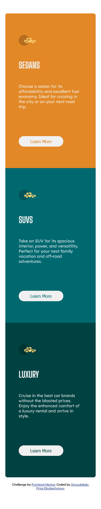
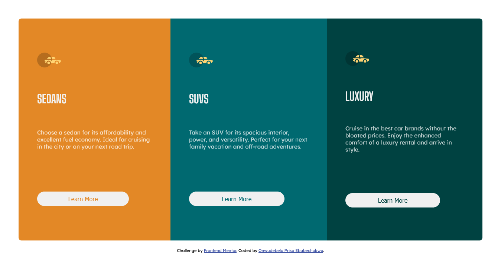

# Frontend Mentor - 3-column preview card component solution

This is a solution to the [3-column preview card component challenge on Frontend Mentor](https://www.frontendmentor.io/challenges/3column-preview-card-component-pH92eAR2-). Frontend Mentor challenges help you improve your coding skills by building realistic projects. 

## Table of contents

- [Overview](#overview)
  - [The challenge](#the-challenge)
  - [Screenshot](#screenshot)
  - [Links](#links)
- [My process](#my-process)
  - [Built with](#built-with)
  - [Continued development](#continued-development)
  - [Useful resources](#useful-resources)
- [Author](#author)

**Note: Delete this note and update the table of contents based on what sections you keep.**

## Overview
In general, I had fun creating this project, and this was because I used mobile first approach for this project.
### The challenge

One of the challenges I encountered was understanding the media queries because I had to reverse it because I was using Mobile-first approach, lol, I was getting a bit confused for the measurements, so yeah...

Users should be able to:

- View the optimal layout depending on their device's screen size
- See hover states for interactive elements

### Screenshot

### Links

- Solution URL: [Add solution URL here](https://github.com/PriscaTonia/frontendMentors-challenge-2)
- Live Site URL: [Add live site URL here](https://frontend-mentors-challenge-2.vercel.app/)

## My process

So, I started with getting my required font-family from google fonts, and setting up my html page, after that I started with my HTML structure, I basically created a div, which contains three sections, each section for a card.
I styled my project using CSS Flexbox for the most part. It was really a life saver.
I also adopted the Mobile-First approach, and basically I didn't experience much difference than I usually do with a Desktop-First approach, maybe it is because of the size of the project.. I look forward to testing this theory out some more.
### Built with

- Semantic HTML5 markup
- CSS custom properties
- Flexbox
- Mobile-first workflow

### Continued development

I would like to learn how to implent media queries better, and also use the mobile-first workflow more frequently, lets say for my next project.

### Useful resources
One of my useful resources, actually my only useful resource is google (laughs...), so when I encounter any problem, I basically go to google to search for similar problems and their solutions. I didn't encounter much problems though, so yeah.. that's it.

## Author

- Website - [Onwudebelu Prisca Ebubechukwu](https://www.your-site.com)
- Frontend Mentor - [@PriscaTonia](https://www.frontendmentor.io/profile/PriscaTonia)
- Twitter - [@EbubePrisca](https://www.twitter.com/EbubePrisca)

